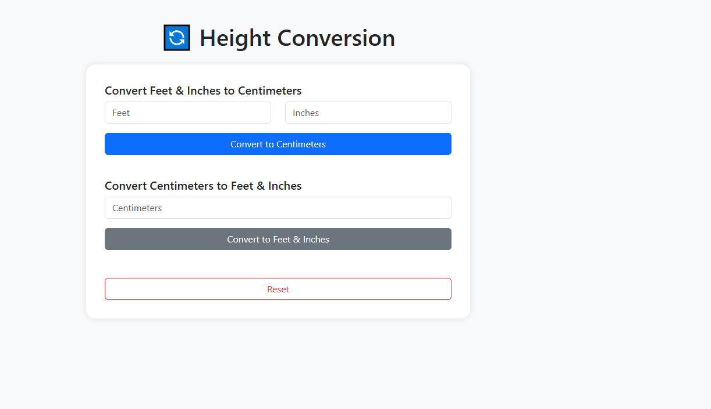

# 📝 Height Conversion

Une application web simple qui permet aux utilisateurs de convertir une taille (hauteur) entre différentes unités (par exemple : pieds et pouces ↔ centimètres).

---

## 📋 Description générale
Height Conversion est une application web éducative et utilitaire conçue pour :

🌍 Permettre aux utilisateurs du monde entier de convertir leur taille dans des unités qu'ils comprennent.

🔄 Offrir une conversion en temps réel ou par bouton.

✅ Accepter une saisie en pieds et pouces (feet & inches) ou en centimètres, et afficher le résultat converti dans l’autre unité.


---

## 🚀 Fonctionnalités principales

📏 Entrée en pieds et pouces → conversion en centimètres

📐 Entrée en centimètres → conversion en pieds et pouces

🔁 Conversion dans les deux sens (bidirectionnelle)

🧠 Calculs précis avec arrondis à deux décimales

💡 Feedback clair avec résultat affiché dynamiquement

🔄 Bouton Réinitialiser

📱 Responsive : fonctionne sur mobile et desktop

---

## 🛠️ Technologies utilisées

🌐 HTML5 — structure de la page

🎨 CSS3 / Bootstrap 5 — style et mise en page responsive

⚙️ JavaScript / jQuery — logique de conversion et gestion des événements

---

💡 Exemples de conversion
5 ft 10 in = 177.8 cm

160 cm = 5 ft 2.99 in

## 📸 Capture d'écran 

Ajoute ici une capture si tu veux :




## 🔗 Démo en ligne

👉 [Clique ici pour essayer Number Guessing Game](https://abdelwaheb-net.github.io/Height-Conversion
/)


## 📁 Structure du projet
```
Height-Conversion/
├──JQuery
    ├──jquery-3.7.1.min.js
├── index.html
├── screenshot.png
├── script.js
└── README.md
```
## 📄 Licence

Ce projet est open-source sous licence MIT.
### 🌐 Langue / Language

- 🇫🇷 [Lire en Français](./README.fr.md)
- 🇬🇧 [Read in English](./README.md)
