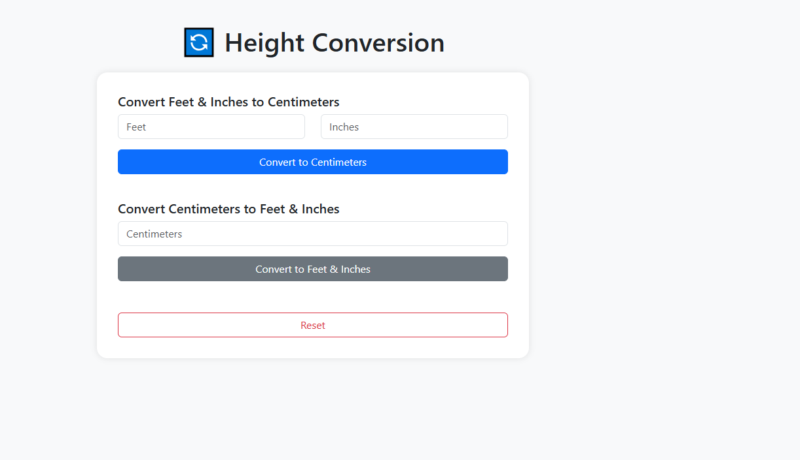

# 📝 Height Conversion

A simple web application that allows users to convert height between different units (e.g., feet & inches ↔ centimeters).

---

## 📋 General Description

**Height Conversion** is an educational and utility web application designed to:

🌍 Help users around the world convert their height into units they are familiar with.

🔄 Provide real-time or button-based conversion.

✅ Accept input in feet & inches or in centimeters, and display the converted result in the other unit.

---

## 🚀 Main Features

📏 Input in feet and inches → conversion to centimeters

📐 Input in centimeters → conversion to feet and inches

🔁 Two-way conversion (bidirectional)

🧠 Accurate calculations with results rounded to two decimal places

💡 Clear feedback with dynamic result display

🔄 Reset button to clear the form

📱 Responsive design: works on both mobile and desktop

---

## 🛠️ Technologies Used

🌐 **HTML5** — page structure

🎨 **CSS3 / Bootstrap 5** — styling and responsive layout

⚙️ **JavaScript / jQuery** — conversion logic and event handling

---

## 💡 Example Conversions

- `5 ft 10 in` = `177.8 cm`
- `160 cm` = `5 ft 2.99 in`

---

## 📸 Screenshot

Add a screenshot here if you like:



---

## 🔗 Live Demo

👉 [Click here to try Height Conversion](https://abdelwaheb-net.github.io/Height-Conversion/)

---

## 📁 Project Structure

```
Height-Conversion/
├──JQuery
    ├──jquery-3.7.1.min.js
├── index.html
├── screenshot.png
├── script.js
└── README.md
```
## 📄 License

This project is open-source under the MIT License.

### 🌐 Language

- 🇫🇷 [Lire en Français](./README.fr.md)
- 🇬🇧 [Read in English](./README.md)